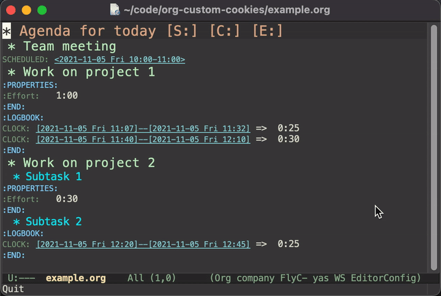

# org-custom-cookies
[](https://www.gnu.org/licenses/gpl-3.0)
[](https://melpa.org/#/org-custom-cookies)

A package that allows you to define custom `org-mode` [statistics cookies](https://orgmode.org/manual/Breaking-Down-Tasks.html).

<p align="center">
    
</p>

## Installation

You can install from MELPA with `M-x package-install org-custom-cookies` or with [`use-package`](https://github.com/jwiegley/use-package):
```elisp
(use-package org-custom-cookies
  :ensure t)
```

Examples of adding bindings and hooks are given below.

## Usage

`org-custom-cookies` allows you to define your own custom cookies, but it comes with three cookie types built-in. The `[S:]` cookie will be replaced with the sum of all the scheduled time in the subtree, `[C:]` will be replaced with the total clocked time (equivalent to the `CLOCKSUM` special property), and `[E:]` will be replaced with the sum of all the `Effort` properties in the subtree. For example:
```org
* Agenda for today [S:] [C:] [E:]
** Team meeting
SCHEDULED: <2021-11-05 Fri 10:00-11:00>
** Work on project 1
:PROPERTIES:
:Effort:   1:00
:END:
:LOGBOOK:
CLOCK: [2021-11-05 Fri 11:07]--[2021-11-05 Fri 11:32] =>  0:25
CLOCK: [2021-11-05 Fri 11:40]--[2021-11-05 Fri 12:10] =>  0:30
:END:
** Work on project 2
*** Subtask 1
:PROPERTIES:
:Effort:   0:30
:END:
*** Subtask 2
:LOGBOOK:
CLOCK: [2021-11-05 Fri 12:20]--[2021-11-05 Fri 12:45] =>  0:25
:END:
```

Running `M-x org-custom-cookies-containing-subtree` with `point` anywhere inside the subtree containing the custom cookies will update the headline containing the cookies to this:
```org
* Agenda for today [S: 1:00] [C: 1:20] [E: 1:30]
```

If any changes are made to the scheduled times, clocked times, or effort, running this command again will update the cookie values to the new values.

There are five different functions that can be used for updating custom cookies:

- `org-custom-cookies-update-current-heading`: Update any custom cookies defined in the heading of the item point is currently at
- `org-custom-cookies-update-nearest-heading`: Update any custom cookies defined in the heading of the current item if any exist, otherwise search for the closest parent heading with the custom cookie and update that heading. Any further parent headings are not updated.
- `org-custom-cookies-update-subtree`: Updates any custom cookies found in the current heading and any child heading of the current heading
- `org-custom-cookies-update-containing-subtree`: First finds the topmost parent heading that contains a custom cookie, and then updates all custom cookies in headings in that subtree. This is similar to `org-custom-cookies-update-nearest-heading`, except instead of stopping after finding the custom cookie, it 
- `org-custom-cookies-update-all`: Updates all custom cookies in the buffer
- `org-custom-cookies--update-cookie-ctrl-c-ctrl-c`: Updates cookies under cursor when for keybinding `C-c C-c`.

It's recommended to play around with which one works best for your workflow (I personally prefer `org-custom-cookies-update-containing-subtree`), and bind this to a key. For convenience, using a prefix argument (`C-u`) with any of these will run `org-custom-cookies-update-all`.

### Keybindings and Hooks

The `use-package` configuration below will `advise` `org-update-statistics-cookies` to run `org-custom-cookies-update-containing-subtree`, which will result in custom cookies being updated whenever built-in statistics cookie are updated, meaning that `C-c #` will also work with the custom cookies. It then enables `C-c C-c` for updating custom cookies. Finally, it adds hooks that will be run when you clock out, as well as when the "Effort" property is updated.

```elisp
(use-package org-custom-cookies
  :ensure t
  :after org
  :config
  (advice-add 'org-update-statistics-cookies :after 
	  'org-custom-cookies-update-containing-subtree)
  (add-hook 'org-ctrl-c-ctrl-c-hook 'org-custom-cookies--update-cookie-ctrl-c-ctrl-c)
  (add-hook 'org-clock-out-hook 'org-custom-cookies-update-containing-subtree)
  (add-hook 'org-property-changed-functions
            (lambda(name value)
              (when (string-equal name "Effort")
                (org-custom-cookies-update-containing-subtree)))))
```

### Adding Custom Cookies

You can add your own custom cookies by customizing the `org-custom-cookies-alist` variable. The default value is:

```elisp
(("\\[S: ?\\(?:[0-9]*:[0-9]*\\)?\\]" . org-custom-cookies--subtree-scheduled-duration-cookie)
    ("\\[C: ?\\(?:[0-9]*:[0-9]*\\)?\\]" . org-custom-cookies--subtree-clocksum-cookie)
    ("\\[E: ?\\(?:[0-9]*:[0-9]*\\)?\\]" . org-custom-cookies--subtree-effort-cookie))
```

The keys for the `alist` are the regexes to match in a heading. When a regex matches, the corresponding function is called at the beginning of the matching header. The custom cookie that was matched is then replaced by the return value of this function, which itself should also match the regex so the function can be run in the future to update the cookie value. Avoid adding any regexes that could match multiple custom cookie formats, as that will result in one custom cookie function overwriting the result of another custom cookie function.

## Comparison to `org-columns`

[`org-columns`](https://orgmode.org/manual/Column-View.html) is often used to achieve what this package does, but there are a few benefits of using this package. The first issue is purely aesthetic, where some people may not like how the columns look and may prefer the simpler appearance of a cookie instead. The second issue is a lack of customizability in `org-columns`. While `org-columns` does allow you to show the total clocked time, it doesn't allow you to show the total scheduled time, the total effort, or anything other than the built in columns. With this package, you can customize what data you want shown and how to show it, as long as you can write the elisp functions for this. Finally, the information gets added to the file as actual text, so you don't need to switch between any view or edit modes, and you can do standard text processing on this data if you'd like.
